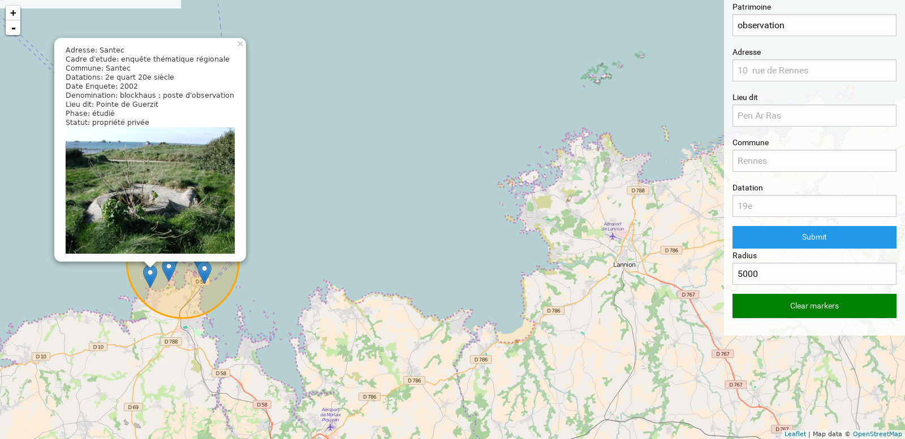

# BreizhTrip

Carte interactive pour découvrir le patrimoine breton recensé

Interactive map to discover breton heritage




## Project
[Roadmap & TODO](https://github.com/mdouchement/breizhtrip-go/projects/1)


## Requirements

- Golang 1.6.x

## Installation

```bash
$ go get github.com/Masterminds/glide
$ glide install
```

## Usage

- **development**

```bash
$ go run breizhtrip.go server -p 5000

# Before pushing to Github
$ find . -name '*.go' -not -path './vendor*' -exec go fmt {} \;
```

> Environment variables https://github.com/mdouchement/breizhtrip-go/blob/master/config/config.go


## Import data to database

```bash
$ go run breizhtrip.go import -i /path/to/your/file.csv
```

The TSV must include these columns header:
- longitude
- latitude
- addresses
- commune
- lieu_dit
- datings
- status
- study
- studied_at
- names
- phase
- photos
- description


## Development

- **Front-end**

Install dependencies

```bash
$ npm install
```

Main Gulp tasks. More commands in [Gulpfile comments](gulpfile.js).

```bash
$ gulp watch # Watch assets, views and go files
$ gulp build # Build assets and server
$ gulp assets:[task] --dev # Add sourcemaps and livereload refresh
```

## License

MIT. See the [LICENSE](https://github.com/mdouchement/breizhtrip-go/blob/master/LICENSE) for more details.

## Contributing

1. Fork it
2. Create your feature branch (git checkout -b my-new-feature)
3. Commit your changes (git commit -am 'Add some feature')
4. Ensure specs and Rubocop pass
5. Push to the branch (git push origin my-new-feature)
6. Create new Pull Request
